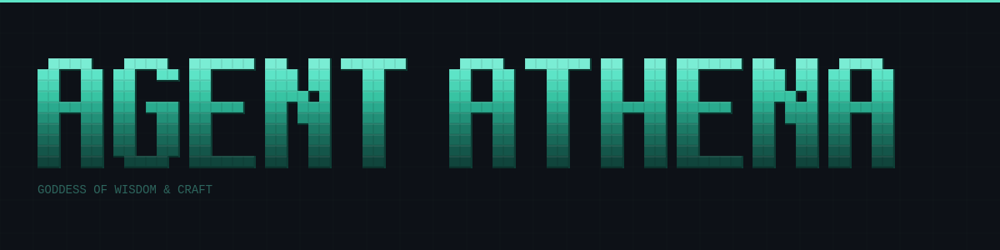
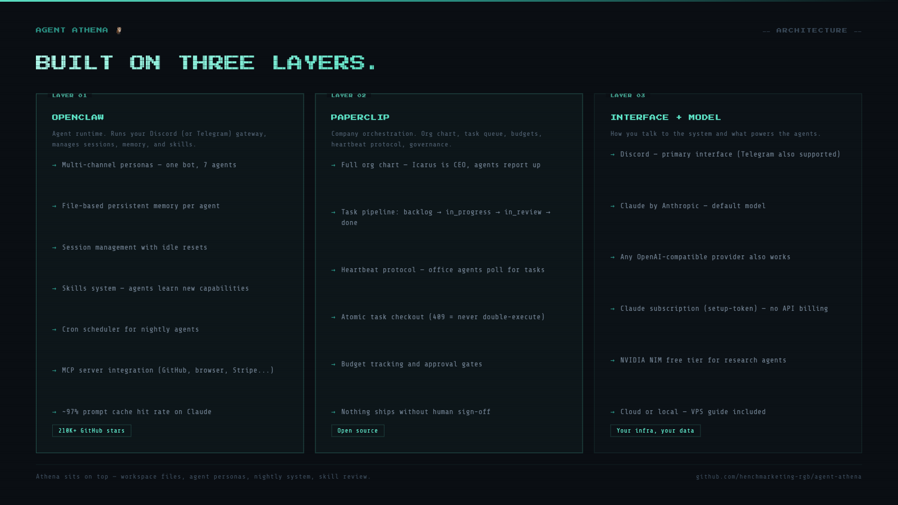
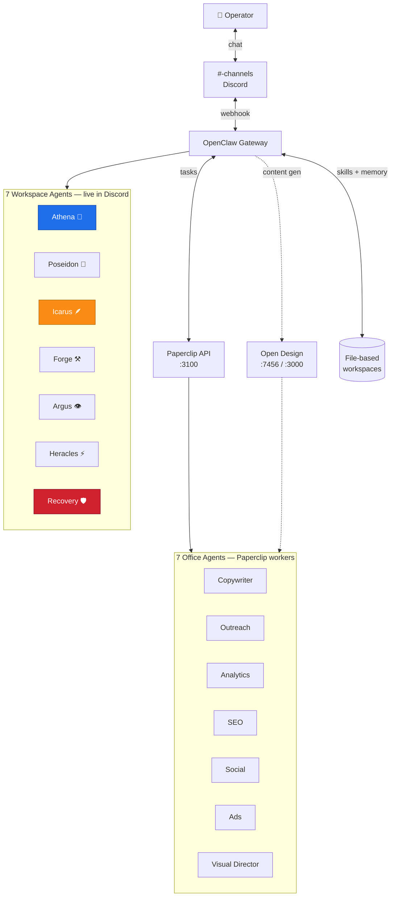
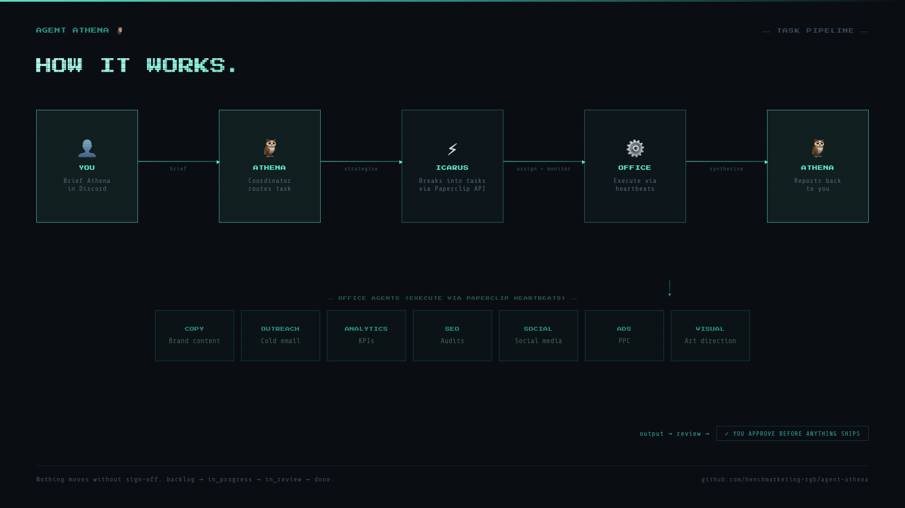
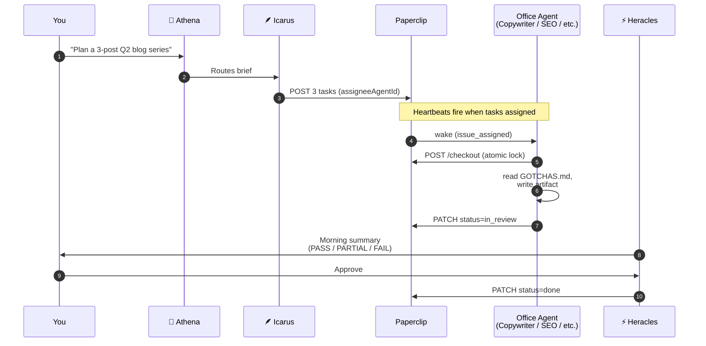
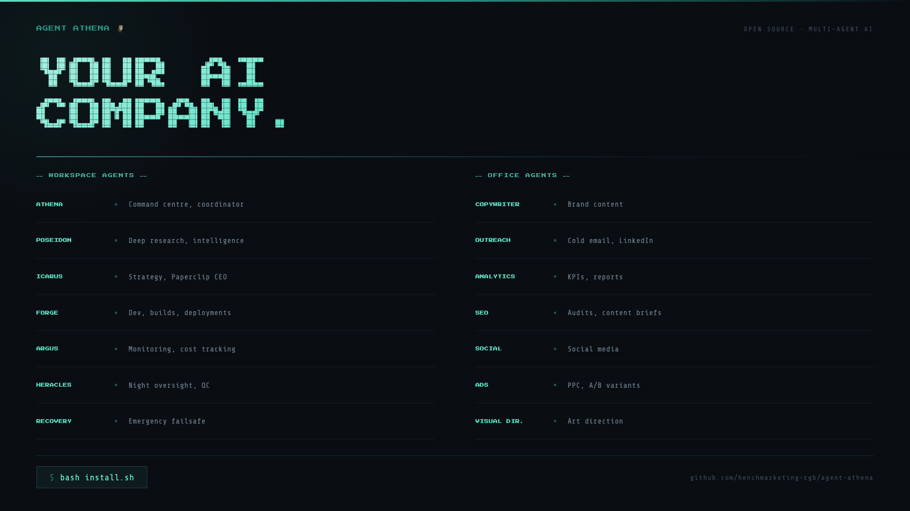
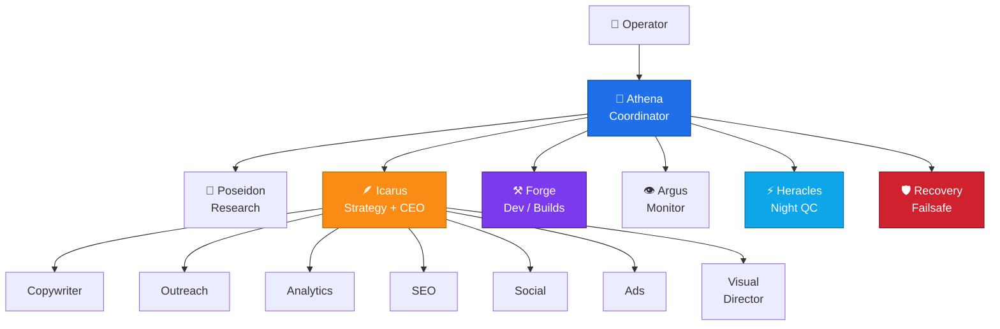
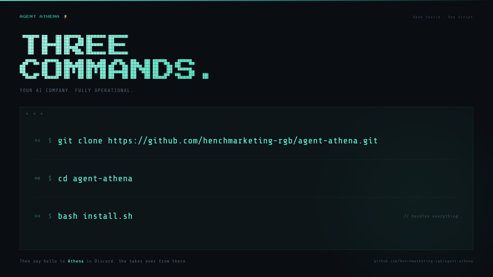
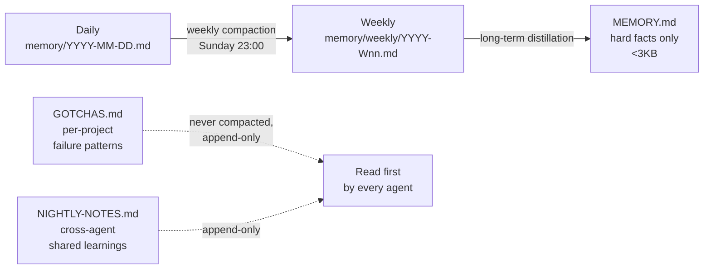
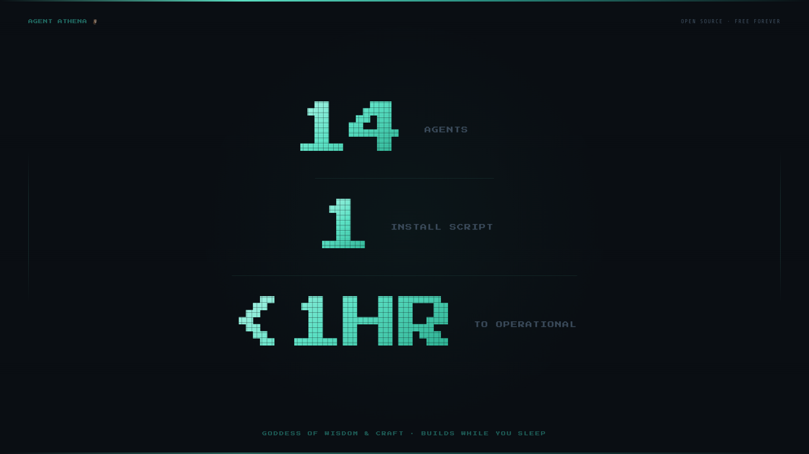

<p align="center">
  
</p>

# Athena 🦉

<p align="center">
  <a href="./LICENSE"></a>
  <a href="./OPERATIONS.md"></a>
  <a href="https://github.com/henchmarketing-rgb/agent-athena/actions/workflows/ci.yml"></a>
  <a href="./SECURITY.md"></a>
  <a href="#stack"></a>
</p>

<p align="center">
  <b>An open-source AI company in a box.</b><br/>
  14 named agents. Discord-first. Builds while you sleep. Runs on any LLM.<br/>
  <code>git clone</code> → <code>bash install.sh</code> → operational in under an hour.
</p>

---

## What Athena is

Athena is a complete [OpenClaw](https://openclaw.ai) configuration: **a production-ready workspace with 14 named agents, an org chart, a task pipeline, a nightly system, and an automated content studio, all wired up and ready to run.**

You brief Athena in Discord. She routes work to specialists. Specialists execute through [Paperclip's](https://github.com/paperclipai/paperclip) heartbeat protocol. Output lands in your project folders. Nothing ships without your sign-off.

It's been running production projects since January 2026.

```bash
git clone https://github.com/henchmarketing-rgb/agent-athena.git
cd agent-athena
bash install.sh
```

That's the install. After it finishes, type `Hi Athena, I'm ready to set up the system.` in `#🦉〡athena`. She walks you through the rest.

---

## How it works (the 30-second version)

<p align="center">
  
</p>

Three layers stacked on top of each other:

| Layer | What it is | What it does |
|---|---|---|
| **Runtime** ([OpenClaw](https://openclaw.ai) or [Hermes Agent](https://github.com/nousresearch/hermes-agent)) | Discord gateway, memory, sessions, cron, skills | Hosts the gateway and serves the personas |
| **Paperclip** | The task layer | Org chart, task queue, budgets, heartbeat-driven execution |
| **Athena** | This repo | The workspaces, agent personalities, scripts, and operational glue |

Pick your runtime at install time. The install script asks. Both runtimes deliver the full Athena value (14 personas, escalation pipeline, nightly automation, Paperclip office team). They differ in how the team shows up: OpenClaw multiplexes 14 Discord channels live; Hermes runs one self-improving agent that dispatches the team via cron + Paperclip. See [docs/RUNTIME-ADAPTERS.md](./docs/RUNTIME-ADAPTERS.md) for the full comparison.

Plus an **optional [Open Design](https://github.com/nexu-io/open-design)** integration that drives content generation (the OSS alternative to Claude Design: 19 Skills × 71 Design Systems).



---

## The pipeline

What happens when you brief Athena.

<p align="center">
  
</p>



**Workspace agents** (Discord). Each Discord channel binds to one agent with its own SOUL.md + IDENTITY.md + AGENTS.md. One bot token, multiple personas.

**Office agents** (Paperclip workers). They wake on heartbeat, atomically check out a task (409 = never retry, somebody else has it), execute, and write output to the project folder. Session context persists across heartbeats.

**Icarus is the bridge.** Lives in Discord with `exec` access. Calls Paperclip API directly via curl to create tasks, assign agents, monitor progress. Icarus is the Paperclip CEO; all office agents report up to Icarus.

---

## The 14 agents

<p align="center">
  
</p>



### Workspace agents (7) — they live in Discord

| Agent | Channel | Role | Has exec? |
|---|---|---|---|
| 🦉 **Athena** | `#🦉〡athena` | Coordinator. Routes work, runs onboarding, owns weekly compaction. | No |
| 🌊 **Poseidon** | `#🌊〡poseidon` | Deep research. Multi-source intelligence, document analysis, competitive briefs. | No |
| 🪶 **Icarus** | `#🪶〡icarus` | Strategy + Paperclip CEO. Turns briefs into tasks for office agents. | Yes |
| ⚒️ **Forge** | `#⚒️〡forge` | Builds, tests, deploys. Blocks on failing builds. | Yes |
| 👁️ **Argus** | `#👁️〡argus` | Continuous monitoring. Site health, cron health, cost spikes, secret leaks. | No |
| ⚡ **Heracles** | `#⚡〡heracles` | Night oversight. Scores nightly runs PASS/PARTIAL/FAIL each morning. | No |
| 🛡️ **Recovery** | `#🛡️〡recovery` | Emergency failsafe. Operator-triggered only. Elevated permissions. | Yes (full) |

### Office agents (7) — they execute via Paperclip

| Agent | Specialty |
|---|---|
| **Copywriter** | Brand content, long-form, voice consistency |
| **Outreach** | Cold email, LinkedIn, follow-up sequences |
| **Analytics** | KPI tracking, dashboards, weekly reports |
| **SEO** | Keyword research, audits, content briefs, meta copy |
| **Social** | Platform-specific posts, scheduling, engagement |
| **Ads** | PPC, A/B variants, Meta/Google copy |
| **Visual Director** | Asset specs, mood boards, brand guidelines, visual QA |

See [docs/AGENT-CAPABILITIES.md](./docs/AGENT-CAPABILITIES.md) for what each agent can and cannot do, and [docs/ESCALATION.md](./docs/ESCALATION.md) for the contract that defines who escalates what to whom.

---

## A day in the life

What an actual operator workflow looks like across a week.

| When | Operator | Workspace agents | Office agents |
|---|---|---|---|
| **Mon 09:00** | Brief Athena | Athena routes to Icarus → creates 3 Paperclip tasks | — |
| **Mon 10:00 → 16:00** | — | Icarus monitors | Copywriter writes 3 posts · SEO drafts brief · Visual Director generates hero images |
| **Mon 17:00** | — | Icarus synthesises status to `#athena` | Output lands in `~/Apps/[project]/content/q2-series/` |
| **Mon 02:00 (overnight)** | — | Forge runs nightly: GOTCHAS → branch → build → test → commit → push → report | — |
| **Tue 08:00** | Read morning summary | Heracles posts PASS/PARTIAL/FAIL roll-up to `#athena` | — |
| **Wed 08:30** | Review + approve `in_review` items in `#icarus` | Tasks flip to `done` in Paperclip | — |
| **Fri 09:00** | Brief next sprint | Athena routes again | New task batch starts |
| **Sun 23:00** | — | Athena's weekly compaction: daily memory → weekly archive · `skill-review.js` drafts agent-rule updates from real failures | — |

**Monday morning.** You DM Athena `Plan a 3-post Q2 blog series for [project]`. Athena routes to Icarus, who scopes 3 tasks in Paperclip and assigns Copywriter for the posts, SEO for meta + briefs, Visual Director for hero images.

**Monday day.** Office agents wake on Paperclip heartbeats, check out tasks, work in parallel. Output writes to `~/Apps/[project]/content/q2-series/`. Open Design (if installed) generates the hero visuals against your design system.

**Monday night (02:00).** Forge wakes, picks up the project's `AGENT-BRIEF.md`, runs the build, runs tests, commits to a `nightly/2026-05-08` branch, pushes, posts a structured report to `#⚡〡heracles`.

**Tuesday 08:00.** Heracles posts the morning summary in `#🦉〡athena`: which projects PASSED, which were PARTIAL, which FAILED. Includes branch links + the GOTCHAS.md learnings each agent recorded overnight.

**Wednesday.** You review Copywriter's 3 posts. Approve in `#icarus`. Status flips to `done` in Paperclip. They ship.

**Sunday 23:00.** Athena's weekly compaction runs. Daily memory files for the week roll up into `memory/weekly/2026-W19.md`. The skill-review.js script scans every workspace's `GOTCHAS.md` + `NIGHTLY-NOTES.md` for cross-cutting failure patterns and drafts updates to agent rules. You read `SKILL-REVIEW.md` Monday morning, accept what's worth keeping.

---

## Features

<table>
<tr><td><b>14-agent team with org chart</b></td><td>7 workspace agents (Athena, Poseidon, Icarus, Forge, Argus, Heracles, Recovery) plus 7 office specialists (Copywriter, Outreach, Analytics, SEO, Social, Ads, Visual Director). Each has defined capabilities, access levels, and reporting lines documented in <a href="./docs/AGENT-CAPABILITIES.md">AGENT-CAPABILITIES.md</a>.</td></tr>

<tr><td><b>Structured task pipeline</b></td><td>Brief → Icarus strategises → Paperclip API creates tasks → office agents wake via heartbeats → output to project folders → Icarus synthesises → Athena reports back. Approval flow: <code>backlog → todo → in_progress → in_review → done</code>. Nothing ships without sign-off.</td></tr>

<tr><td><b>Autonomous nightly agents</b></td><td>Per-project agents run overnight on cron. Each reads <code>GOTCHAS.md</code> first, creates a dated branch, works the task, verifies the build passes, posts a structured report. Heracles quality-scores every run and posts a morning summary.</td></tr>

<tr><td><b>Cross-agent shared memory</b></td><td><code>NIGHTLY-NOTES.md</code> is shared across all agents. When one agent hits a bug at 3am, every other agent knows about it the next morning. Daily memory files, weekly compaction into long-term <code>MEMORY.md</code>, no memory cap.</td></tr>

<tr><td><b>Self-improving skills</b></td><td>Weekly skill review scans <code>GOTCHAS.md</code>, <code>NIGHTLY-NOTES.md</code>, and daily memory files across all workspaces. Compiles findings into <code>SKILL-REVIEW.md</code>. Athena reads it and updates agent rules based on real production failures, not scheduled updates, but learned behaviour.</td></tr>

<tr><td><b>One-script install</b></td><td>Single <code>bash install.sh</code> handles dependencies (macOS + Linux + branched package managers), model provider, Discord bot setup, all credentials, OpenClaw onboard, workspace files with <code>sed</code>-based template substitution (no <code>[OPERATOR_NAME]</code> placeholders left), gateway start. <b>Idempotent</b>: re-run resumes from the last successful step. <code>--reset</code> wipes state.</td></tr>

<tr><td><b>Content Studio (Open Design)</b></td><td>Optional Step 10 of <code>install.sh</code> integrates <a href="https://github.com/nexu-io/open-design">Open Design</a>, the OSS alternative to Claude Design. 19 composable Skills × 71 brand-grade Design Systems. Drives content generation for Copywriter / Visual Director / Social agents.</td></tr>

<tr><td><b>Switch models anytime</b></td><td>Change LLM after install with <code>bash scripts/switch-model.sh</code> or <code>/model</code> in Discord. Claude (recommended), GPT-4, Gemini, Ollama, or any OpenAI-compatible endpoint. Updates all agents and restarts the gateway.</td></tr>

<tr><td><b>Cost-controlled</b></td><td>~97% cache hit rates on Anthropic prompt caching. Lean workspace files, session idle resets, NVIDIA NIM free tier for research agents. Built to run lean, efficiency is in the architecture, not the config.</td></tr>

<tr><td><b>Fresh-box CI</b></td><td>7 CI jobs run on every push: shellcheck (strict on install.sh), node syntax, sandboxed e2e (38 assertions), <b>real-deps install on Ubuntu fresh-box</b>, <b>real-deps install on macOS fresh-box</b>, npm install + discord.js load, em-dash advisory.</td></tr>
</table>

---

## Prerequisites

| Required | Why |
|---|---|
| **macOS or Linux** | Windows is not currently supported |
| **Node.js 20+** | install.sh checks the version and refuses below 20 |
| **A Discord account + server** you can admin | Athena lives in Discord |
| **A model provider account** | Claude (recommended), or OpenAI / Gemini / Ollama / custom |
| **A GitHub account** | Nightly agents push branches to your repos |
| **~10 minutes** | Most install time is npm + Anthropic auth |

Optional accounts (skippable, the install prompts you):
[Brave Search](https://brave.com/search/api/) (free 2k/mo) ·
[Firecrawl](https://firecrawl.dev) (free 500/mo) ·
[Vercel](https://vercel.com) (deploys).

---

## Quick start

<p align="center">
  
</p>

```bash
git clone https://github.com/henchmarketing-rgb/agent-athena.git
cd agent-athena
bash install.sh
```

The script is **idempotent**: re-running resumes from where it stopped. To start fresh: `bash install.sh --reset`.

When it finishes, go to `#🦉〡athena` in Discord and say hello. Athena walks you through the remaining 7 conversational onboarding phases: channel creation, project briefing, nightly automation setup.

For a fully manual setup, see [INSTALL.md](./INSTALL.md).

> **Note:** Athena is not affiliated with or endorsed by Anthropic. By using this project you agree to comply with [Discord's Developer Terms](https://discord.com/developers/docs/policies-and-agreements/developer-terms-of-service) and your model provider's terms.

---

## Cost

Operating costs depend mostly on your model provider, not the system itself.

| Path | Monthly cost |
|---|---|
| **Claude subscription** (recommended) | $0 in addition. Setup-token uses your existing Pro/Max subscription. |
| **Anthropic API key** | ~$50–$200/mo per active operator. Prompt caching keeps it well below normal usage (~97% cache hits). |
| **GPT-4 / Gemini / Ollama / other** | Provider pricing. Ollama is free + local. |
| **Hosting (optional, 24/7 cloud)** | $4.50–$7/mo on a small VPS. See [CLOUD-DEPLOY.md](./CLOUD-DEPLOY.md). |

Run `node scripts/cost-tracker.js` after a week to see actuals from your session logs.

---

## Memory and self-improvement

Memory is file-based. Three timescales:



| File | Scope | Lifecycle |
|---|---|---|
| `memory/YYYY-MM-DD.md` | Daily session log | Compacts weekly |
| `memory/weekly/YYYY-Wnn.md` | Weekly summary | Distills into MEMORY.md as patterns emerge |
| `MEMORY.md` | Hard facts only | <3KB cap, monitored by HEARTBEAT |
| `GOTCHAS.md` | Per-project failure patterns | Never compacted, append-only, read first |
| `NIGHTLY-NOTES.md` | Cross-agent learnings | Append-only, never edit prior entries |

**Self-improvement loop:** every Sunday, `scripts/skill-review.js` scans every workspace's GOTCHAS + NIGHTLY-NOTES + daily logs. It compiles patterns into `SKILL-REVIEW.md`. Athena reads it and proposes updates to agent SOUL.md / AGENTS.md files. You approve. Agents get smarter from real production failures, not scheduled updates.

---

## Workspace structure

```
workspaces/
  athena/            — Coordinator (routes tasks, runs onboarding, owns compaction)
  poseidon/          — Deep research, intelligence
  icarus/            — Strategy, Paperclip CEO (has exec)
  forge/             — Dev, builds, deployments (has exec)
  argus/             — Monitoring, health, cost tracking
  heracles/          — Night oversight, QC
  recovery/          — Emergency failsafe (elevated exec)
  office/
    copywriter/      — Brand content
    outreach/        — Cold email, LinkedIn
    analytics/       — KPIs, reports
    seo/             — SEO audits, content briefs
    social/          — Social media
    ads/             — PPC, A/B variants
    visual-director/ — Art direction

scripts/             — Operational scripts (backup, cleanup, health, compaction, cost, skill review)
config/              — OpenClaw config template, PM2 ecosystem, sites config
templates/           — Blank templates for new agent workspaces
prompts/             — Nightly agent prompt templates
docs/                — Detailed guides (auth, Paperclip API, MCP servers, onboarding, capabilities, escalation)
tests/               — e2e + real-deps install tests run in CI
```

Each workspace agent has these files (load on every session, they ARE the agent's brain):

| File | Purpose |
|---|---|
| `SOUL.md` | Personality, vibe, principles |
| `IDENTITY.md` | Role, name, emoji, platform |
| `AGENTS.md` | Operating rules, what to read every session |
| `MEMORY.md` | Hard facts only (<3KB) |
| `CURRENT.md` | Live project state |
| `HEARTBEAT.md` | Health checks (silent, only report problems) |
| `CLAUDE.md` | Claude Code context for this workspace |

---

## Documentation

| Guide | What it covers |
|---|---|
| **[INSTALL.md](./INSTALL.md)** | Manual install path. Step-by-step setup if you don't want to run install.sh. |
| **[OPERATIONS.md](./OPERATIONS.md)** | Day 2 operations: troubleshooting, cost architecture, adding/retiring projects, multi-operator, mobile, 30-day milestones. |
| **[CLOUD-DEPLOY.md](./CLOUD-DEPLOY.md)** | Run Athena 24/7 on a cloud VPS. |
| **[SECURITY.md](./SECURITY.md)** | Vuln disclosure, the `dangerouslySkipPermissions` tradeoff, Recovery agent gating. **Read before going live with anyone else in your Discord.** |
| **[docs/ESCALATION.md](./docs/ESCALATION.md)** | Argus / Heracles / Recovery / Athena hand-off contract, severity ladder, three Recovery activation gating options. |
| **[docs/AGENT-CAPABILITIES.md](./docs/AGENT-CAPABILITIES.md)** | What each agent can and cannot do. |
| **[docs/PAPERCLIP-API.md](./docs/PAPERCLIP-API.md)** | Heartbeat protocol, endpoints, org chart, task lifecycle. |
| **[docs/CLAUDE-AUTH-SETUP.md](./docs/CLAUDE-AUTH-SETUP.md)** | Setup-token (subscription) vs API key auth. |
| **[docs/MCP-SERVERS.md](./docs/MCP-SERVERS.md)** | Recommended MCP servers for extended capabilities. |
| **[docs/ONBOARDING-PHASES.md](./docs/ONBOARDING-PHASES.md)** | The 7 conversational onboarding phases Athena runs after install.sh. |
| **[docs/DESIGN-STUDIO.md](./docs/DESIGN-STUDIO.md)** | Optional Playwright + Firecrawl setup. |

---

## Scripts

| Script | Purpose |
|---|---|
| `install.sh` | One-script installer: deps, auth, Discord, credentials, onboard, gateway, Open Design, Design Studio. |
| `scripts/discord-setup.js` | Create the 7 Discord agent channels via API + post pinned intros. Idempotent. |
| `scripts/paperclip-setup.js` | Idempotent Paperclip agent registration (Icarus + 7 office agents). |
| `scripts/create-project.js` | Scaffold a new project workspace + register a Paperclip goal. |
| `scripts/switch-model.sh` | Switch LLM provider/model. Updates all agents, restarts gateway. |
| `scripts/skill-review.js` | Weekly scan of failures + learnings → `SKILL-REVIEW.md`. |
| `scripts/weekly-compaction.js` | Summarise old daily memory files into weekly archives. |
| `scripts/full-backup.sh` | Daily workspace + session backup with auto GitHub push. |
| `scripts/cost-tracker.js` | API cost tracking and reporting. |
| `scripts/nightly-report.js` | Agent success/failure rates over last N days. |
| `scripts/session-cleanup.js` | Purge orphaned executor sessions. |
| `scripts/site-health.js` | Check live sites are responding. |
| `scripts/secrets-check.js` | Scan workspace files for exposed credentials. |
| `scripts/alert.js` | Heartbeat + incident webhook (UptimeRobot / Healthchecks.io / any). Argus + Heracles call this. |
| `scripts/strip-em-dashes.js` | Markdown em-dash linter (used in CI). |
| `scripts/paperclip-setup.sh` | Legacy bash version of paperclip-setup.js (fallback). |
| `tests/e2e-install.sh` | Sandboxed install e2e (all deps stubbed, 38 assertions). |
| `tests/real-install.sh` | Real-deps install on Ubuntu + macOS fresh-box CI runners. |

---

## Content generation: Open Design

Step 10 of `install.sh` offers an optional [Open Design](https://github.com/nexu-io/open-design) integration. **Recommended** — it generates most of Athena's content (social cards, blog posts, decks, landing pages, product visuals).

Open Design runs locally as a daemon + web UI. It detects your installed coding-agent CLI (Claude Code, Codex, Cursor Agent, Gemini, OpenCode, Qwen, Copilot CLI) and uses it as the design engine, driven by 19 composable Skills × 71 brand-grade Design Systems.

```bash
# install.sh Step 10 does this for you
git clone https://github.com/nexu-io/open-design.git ~/Apps/open-design
cd ~/Apps/open-design && pnpm install
pnpm dev:all   # daemon :7456 + web :3000
```

Open `http://localhost:3000`, pick a Skill (`web-prototype`, `dashboard`, `pricing-page`, `blog-post`, `simple-deck`, `magazine-web-ppt`, etc.) and a Design System (Apple, Airbnb, BMW, Binance, etc., or a hand-authored one), type a prompt, get an artifact. Athena's office agents reach into Open Design programmatically to produce content that matches your brand.

Skip during install? Add later:
```bash
git clone https://github.com/nexu-io/open-design.git ~/Apps/open-design
cd ~/Apps/open-design && pnpm install
```

---

## Stack

- **Runtime** — Pick at install time. Both deliver the full Athena value, the difference is delivery model:
  - **[OpenClaw](https://openclaw.ai)** *(default)* — Multi-agent multi-channel topology. One Discord bot, 14 channels, one persona per channel. Live multi-agent chat. Node.js. Native Athena topology.
  - **[Hermes Agent](https://github.com/nousresearch/hermes-agent)** — Single-profile self-improving agent. Athena fronts; the other 13 personas load as skills she dispatches via cron + Paperclip. Python. Built-in skills library, MCP server, OpenRouter routing.
  - See [docs/RUNTIME-ADAPTERS.md](./docs/RUNTIME-ADAPTERS.md) for the full comparison and trade-offs.
- **[Paperclip](https://github.com/paperclipai/paperclip)** — The task layer. Org chart, task queue, budgets, heartbeat protocol, governance. Office agents run as Paperclip heartbeat workers. Runtime-agnostic.
- **[Open Design](https://github.com/nexu-io/open-design)** *(optional)* — Content generation. OSS alternative to Claude Design. 19 Skills × 71 Design Systems. Optional Step 10 of `install.sh`.
- **Model** — Built and tested on [Claude](https://console.anthropic.com) (setup-token uses your existing subscription). Both runtimes support any OpenAI-compatible provider via direct keys (OpenClaw) or OpenRouter (Hermes).
- **Discord** — Primary interface. Telegram also supported by both runtimes.

---

## How Athena compares

| | Athena | Bare OpenClaw / Hermes | Multi-agent frameworks (LangGraph, CrewAI, AutoGen) |
|---|---|---|---|
| **Time to first agent** | `bash install.sh`, ~1hr | Several days of config | Several days of config |
| **Org chart out of the box** | 14 named agents | None | None (you design it) |
| **Task pipeline** | Paperclip-backed, governance-gated | None | Library-specific |
| **Memory + compaction** | File-based, weekly compaction, GOTCHAS, NIGHTLY-NOTES | Yes (basic) | Library-specific |
| **Runtime portability** | OpenClaw OR Hermes Agent — pick at install | Single-runtime | N/A |
| **Discord-native** | Yes, channel-per-agent (OpenClaw) or Athena-fronted (Hermes) | Yes | No (Python/JS code) |
| **Self-improvement loop** | Weekly skill-review.js | None | None |
| **Content generation** | Open Design (Step 10) | None | None |
| **Operator interface** | Conversational, in Discord | CLI / config files | Code |
| **Real fresh-box install CI** | Ubuntu + macOS, both runtimes | None | None |

Athena is opinionated where the underlying frameworks are flexible. The opinions exist because they were earned in production: the heartbeat protocol's atomic `409` checkout, the `set -e` error handling in install.sh, the SECURITY.md `dangerouslySkipPermissions` warnings, the Recovery activation gating in ESCALATION.md.

---

## What you get on Day 1 vs Day 30

<p align="center">
  
</p>

**Day 1** (after `bash install.sh` + 7 Athena phases):
- Athena replying in `#🦉〡athena` (OpenClaw) or via her single Discord channel (Hermes)
- 7 Discord channels, one per workspace agent (OpenClaw) — or one active channel with Athena fronting and orchestrating (Hermes)
- Paperclip running on `:3100` with Icarus + 7 office agents registered
- `~/.env.secrets` populated, sourced from your shell profile
- All 14 agent workspaces under `~/.openclaw/workspaces/` or `~/.hermes/workspaces/` (depending on runtime)
- One project briefed and ready for the first nightly run

**Day 7**:
- 6 nightly runs logged
- First weekly skill-review.js report
- First Heracles morning summaries
- Cost-tracker showing real per-agent spend
- First few entries in `NIGHTLY-NOTES.md`

**Day 30**:
- 4 weekly compactions
- 30 daily memory files (10 archived) per agent
- ~120 nightly runs across all projects
- Self-improvement: agent rules updated 2–3× from real failures
- Stable cost picture
- The system runs without you for stretches

---

## What ships in v0.1.0

| Capability | Where |
|---|---|
| 14-agent system with org chart | `workspaces/` + `templates/OFFICE.md` |
| Idempotent one-script install (macOS + Linux) | `install.sh` |
| Windows abort with WSL guidance | `install.sh` Windows detection block |
| Discord channel + intro automation | `scripts/discord-setup.js` |
| Idempotent Paperclip agent registration | `scripts/paperclip-setup.js` |
| Project workspace scaffolding | `scripts/create-project.js` |
| Self-improving skills loop | `scripts/skill-review.js` → `SKILL-REVIEW.md` |
| Weekly memory compaction | `scripts/weekly-compaction.js` |
| Per-agent cost tracking | `scripts/cost-tracker.js` |
| **Per-project cost budgets** | `scripts/cost-tracker.js --budgets` + `templates/BUDGETS.md` |
| Auto GitHub backup | `scripts/full-backup.sh` |
| **Real-time alerting (heartbeat + incident)** | `scripts/alert.js` + `ALERT_WEBHOOK_URL` |
| Cloud deployment guide (3 paths: VPS / Fly / Render) | [CLOUD-DEPLOY.md](./CLOUD-DEPLOY.md) |
| **Cloud gateway templates (Fly.io + Render.com)** | `deploy/fly.toml`, `deploy/render.yaml` |
| Escalation contract (Argus/Heracles/Recovery/Athena) | [docs/ESCALATION.md](./docs/ESCALATION.md) |
| Open Design content-generation integration | `install.sh` Step 10 → [nexu-io/open-design](https://github.com/nexu-io/open-design) |
| Real-deps install CI on Ubuntu + macOS fresh boxes | `.github/workflows/ci.yml` |
| Sandboxed e2e test (38 assertions) | `tests/e2e-install.sh` |

## Help wanted

Concrete contributions that would extend Athena. Open an issue first if you want to take one of these on, so we can scope it together.

- **Paperclip auto-reconnect** — currently if the Paperclip session expires mid-run, the office agent reports an error and you re-run. A reconnect-and-retry handler in the heartbeat protocol would fix this. Lives in [Paperclip](https://github.com/paperclipai/paperclip), not this repo.
- **Telegram-first variant** — OpenClaw supports Telegram. Mirroring the channel-per-agent setup on Telegram (with appropriate group/supergroup conventions) would unblock operators who don't want to run Discord. Substantial: requires re-doing the bot setup, channel binding, and message-routing logic.
- **Native Windows support** — `install.sh` currently aborts on Windows with a clear "use WSL" message. A PowerShell port (or a Windows-native bash via Git Bash with all the package-manager branches handled) would expand the audience.
- **Per-task hard budget caps in Paperclip** — `scripts/cost-tracker.js` ships soft per-project budgets that warn the operator. Hard caps that an agent honours when accepting tasks would prevent runaway spend mid-run. Lives in Paperclip's task-assignment logic.

See [CONTRIBUTING.md](./CONTRIBUTING.md) for how to propose a change.

---

## FAQ

**Do I have to use Discord?** Currently yes — workspace agents bind to Discord channels. OpenClaw also supports Telegram, and the Telegram-first variant is on the roadmap.

**Do I have to use Claude?** No. Step 3 of install.sh lets you pick OpenAI, Gemini, Ollama (local + free), or any OpenAI-compatible endpoint. Claude is recommended because the Pro/Max subscription path means $0 additional API billing and the prompt caching is best-in-class.

**Is Paperclip required?** Yes for the office team. The 7 office agents (Copywriter, SEO, Social, etc.) run as Paperclip heartbeat workers. Without Paperclip you have the 7 workspace agents only.

**Will running this leak my data?** Athena uses your model provider's API. What you brief Athena goes to that provider. Workspace files are local. `~/.env.secrets` is local (chmod 600). See [SECURITY.md](./SECURITY.md) for the full threat model.

**What happens if I run `install.sh` twice?** It resumes from the last successful step. To start fresh: `bash install.sh --reset`. Existing secrets are merged, not truncated. Workspace files are backed up to `*.bak.<timestamp>` before overwrite.

**Can I have more than one Athena on the same machine?** Not currently — install paths are at `~/.openclaw/`. Multiple operators on different machines work fine.

**Why is `dangerouslySkipPermissions` important?** It defaults to `false` here. Setting it to `true` lets agents run without permission prompts (good for unattended nightly work) but turns prompt injection in agent input into shell execution. See [SECURITY.md](./SECURITY.md) before enabling.

**How do I add a new project?** `node scripts/create-project.js "Project Name" --repo https://github.com/...`. Scaffolds the workspace + registers a Paperclip goal.

**How do I add a new agent?** Easiest: copy a workspace dir, edit SOUL/IDENTITY/AGENTS, add a Discord channel + binding to `openclaw.json`, restart the gateway. Adding an office agent: register via the Paperclip API (see `scripts/paperclip-setup.js` for the pattern).

**What if a nightly run fails?** Heracles marks it FAIL in the morning summary. You decide: re-run, skip, or escalate to Recovery. See [docs/ESCALATION.md](./docs/ESCALATION.md).

---

## Contributing

See [CONTRIBUTING.md](./CONTRIBUTING.md). Help wanted on:
- Cross-platform install (macOS + Ubuntu/Debian work; other Linux distros need testing)
- Telegram parity with Discord
- More design-system integrations beyond Open Design
- Doc improvements, especially OPERATIONS.md troubleshooting

We have a 7-job CI on every PR. Real-deps install runs on Ubuntu + macOS fresh-box runners — your changes get exercised end-to-end.

## Security

Found a vulnerability? See [SECURITY.md](./SECURITY.md) for the disclosure process.

The dominant risk to operators is `dangerouslySkipPermissions: true` combined with agents that consume external content. Athena ships with the safe default (`false`) and documents the tradeoff in 5 places.

## License

[MIT](./LICENSE). Use it however you want, just keep the notice.

---

<p align="center">
  <i>Athena — wisdom and craft. Builds while you sleep. Runs on any LLM.</i>
</p>
